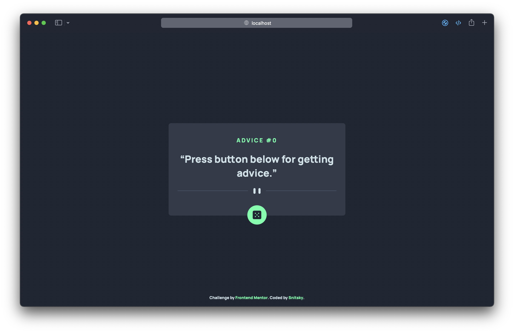

# Frontend Mentor - Advice generator app solution

This is a solution to the [Advice generator app challenge on Frontend Mentor](https://www.frontendmentor.io/challenges/advice-generator-app-QdUG-13db).

## Table of contents

- [Frontend Mentor - Advice generator app solution](#frontend-mentor---advice-generator-app-solution)
  - [Table of contents](#table-of-contents)
  - [Overview](#overview)
    - [The challenge](#the-challenge)
    - [Screenshot](#screenshot)
    - [Links](#links)
  - [My process](#my-process)
    - [Built with](#built-with)
    - [What I learned](#what-i-learned)
    - [Useful resources](#useful-resources)
  - [Note](#note)
  - [Author](#author)

## Overview

### The challenge

Users should be able to:

- View the optimal layout for the app depending on their device's screen size :white_check_mark:
- See hover states for all interactive elements on the page :white_check_mark:
- Generate a new piece of advice by clicking the dice icon :white_check_mark:

### Screenshot

### Links

- Solution URL: [GitHub](https://github.com/ksnitsky/Frontent-Mentor-Challenges/tree/main/Advice-generator-app)
- Live Site URL: [Vercel](https://advice-generator-app-nu.vercel.app)

## My process

### Built with

- Semantic HTML5 markup
- SCSS preprocessor for CSS
- BEM (I hope I used it correctly)
- Mobile-first workflow
- [Vite](https://vitejs.dev) for developing and building a project
- Vanilla JS (ES6) for getting data from [Advice Slip API](https://api.adviceslip.com)
- VSCode

### What I learned

This was my first experience with ES6 and async functions. Also first time working with API from frontend. 

Learned how to use Vite as a project build tool.

### Useful resources

- [Sass documentation](https://sass-lang.com/documentation/at-rules/import) - Made me realize not to use @import to include other .scss files.
- [Fetch API JS](https://developer.mozilla.org/en-US/docs/Web/API/Fetch_API/Using_Fetch) - Helped me figure out how to get data from api

## Note

- Perhaps the solution will look bad on screens with a height below 340px

## Author

- GitHub - [@ksnitsky](https://github.com/ksnitsky)
- Frontend Mentor - [@ksnitsky](https://www.frontendmentor.io/profile/ksnitsky)
