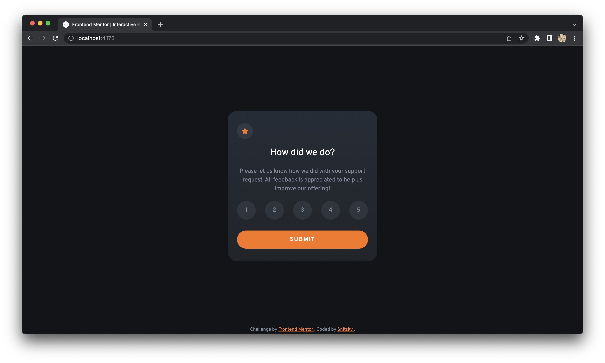

# Frontend Mentor - Interactive rating component solution

This is a solution to the [Interactive rating component challenge on Frontend Mentor](https://www.frontendmentor.io/challenges/interactive-rating-component-koxpeBUmI).

## Table of contents

- [Frontend Mentor - Interactive rating component solution](#frontend-mentor---interactive-rating-component-solution)
  - [Table of contents](#table-of-contents)
  - [Overview](#overview)
    - [The challenge](#the-challenge)
    - [Screenshot](#screenshot)
    - [Links](#links)
  - [My process](#my-process)
    - [Built with](#built-with)
    - [Useful resources](#useful-resources)
  - [Author](#author)

## Overview

### The challenge

Users should be able to:

- View the optimal layout for the app depending on their device's screen size :white_check_mark:
- See hover states for all interactive elements on the page :white_check_mark:
- Select and submit a number rating :white_check_mark:
- See the "Thank you" card state after submitting a rating :white_check_mark:

### Screenshot

### Links

- Solution URL: [Frontend Mentor](https://www.frontendmentor.io/solutions/interactive-rating-component-using-tailwindcss-and-vanillajs-Sy_mV-sGq)
- Live Site URL: [Vercel](https://interactive-rating-component-topaz.vercel.app)

## My process

### Built with

- Semantic HTML5 markup
- [Tailwind CSS](https://tailwindcss.com/) - a utility-first CSS framework
- Vanilla JS
- [Vite](https://vitejs.dev/) - frontend build tool

### Useful resources

- [Tailwind CSS](https://tailwindcss.com/docs/installation) - basic documentation with a search is ideal for learning the framework.
- [Google](https://www.google.com/) - you know.

## Author

- GitHub - [@ksnitsky](https://github.com/ksnitsky)
- Frontend Mentor - [@ksnitsky](https://www.frontendmentor.io/profile/ksnitsky)
