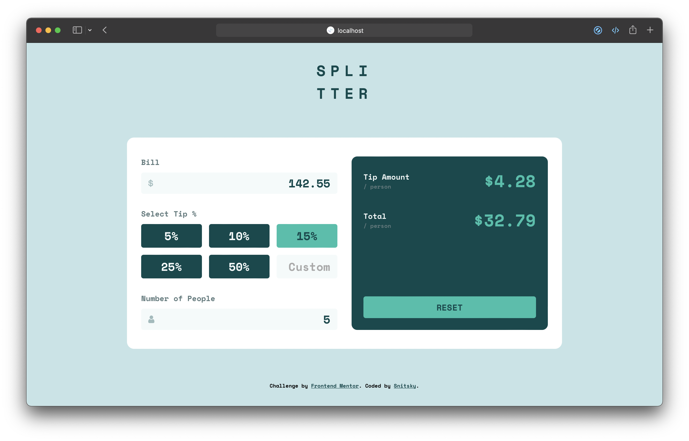

# Frontend Mentor - Tip calculator app solution

This is a solution to the [Tip calculator app challenge on Frontend Mentor](https://www.frontendmentor.io/challenges/tip-calculator-app-ugJNGbJUX).

## Table of contents

- [Frontend Mentor - Tip calculator app solution](#frontend-mentor---tip-calculator-app-solution)
  - [Table of contents](#table-of-contents)
  - [Overview](#overview)
    - [The challenge](#the-challenge)
    - [Screenshot](#screenshot)
    - [Links](#links)
  - [My process](#my-process)
    - [Built with](#built-with)
    - [What I learned](#what-i-learned)
    - [Useful resources](#useful-resources)
  - [Author](#author)

## Overview

### The challenge

Users should be able to:

- View the optimal layout for the app depending on their device's screen size :white_check_mark:
- See hover states for all interactive elements on the page :white_check_mark:
- Calculate the correct tip and total cost of the bill per person :white_check_mark:

### Screenshot



### Links

- Solution URL: [GitHub](https://github.com/ksnitsky/Frontend-Mentor-Challenges/tree/main/Tip-calculator)
- Live Site URL: [Vercel](https://tip-calculator-app-gamma.vercel.app)

## My process

### Built with

- SCSS preprocessor for CSS
- A bit BEM
- Flexbox
- CSS Grid (for radio buttons)
- Mobile-first workflow
- [Vue](https://vuejs.org/) - JS framework
- [Vite](https://vitejs.dev/) - frontend build tool

### What I learned

Learned the basic concepts of Vue.js:
- Passing data to child components ([Props](https://vuejs.org/guide/components/props.html))
- Receiving event-based data from child components ([Emits](https://vuejs.org/guide/components/events.html))
- And other


***
  It took me half a day to set up the reset button, but the solution was very simple
```html
  <form class="container" v-on:reset="resetInput">
```
Replaced  `<div>` with `<form>` and added a reset event handler that cleared all fields and then used the resetInput() function that reset all values

### Useful resources

- [Vue.js Guide](https://vuejs.org/guide/introduction.html) - A basic guide to using the framework
- [Google](https://www.google.com/) - Many obscure things were simply googled

## Author

- GitHub - [@ksnitsky](https://github.com/ksnitsky)
- Frontend Mentor - [@ksnitsky](https://www.frontendmentor.io/profile/ksnitsky)
